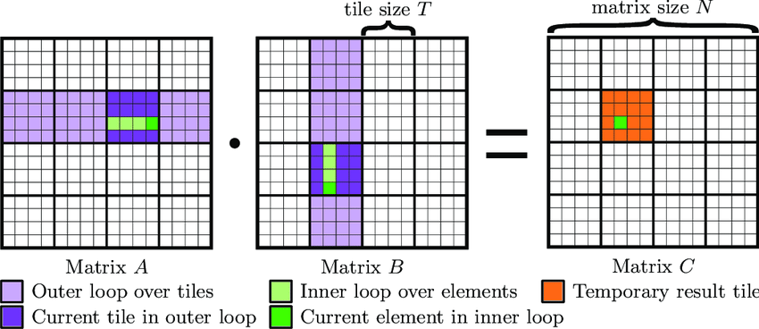

# GEMM на CUDA

## Постановка задачи

**GEMM** (General Matrix Multiplication) — операция умножения матриц с масштабированием, задаваемая формулой:

```
C = alpha * A * B + beta * C
```

где:
- **alpha**, **beta** — скалярные коэффициенты;
- **A** — матрица размера M×K (row-major);
- **B** — матрица размера K×N (row-major);
- **C** — результирующая матрица размера M×N.

В данной задаче требуется реализовать GEMM на CUDA.

## Варианты реализации

Существует несколько подходов к реализации GEMM на GPU (по возрастанию эффективности):

1. **Naive** — каждый поток вычисляет один элемент C, последовательно перебирая общую размерность K в цикле.
2. **Tiling + shared memory** — разбиение матриц на блоки (тайлы), загрузка блоков в shared memory и совместное использование данных потоками внутри блока.
3. **Tensor cores** — использование специализированных матричных ядер (на GPU с поддержкой).
4. **cuBLAS / cuTLASS** — готовые оптимизированные библиотеки.

В рамках задачи реализуется второй вариант.

## Алгоритм: tiling с shared memory

Схема на рисунке:



**Как это работает:**

1. **Кто что считает.** У каждого потока есть своя «клетка» в матрице C — пара (строка, столбец). Индексы берём из `threadIdx` и `blockIdx`.

2. **Что нужно для одной клетки.** Элемент C[row][col] — это скалярное произведение строки row из A и столбца col из B. То есть нужно K умножений и K сложений. В naive-версии поток каждый раз ходит в медленную global memory — это неэффективно.

3. **Идея tiling.** Разбиваем A и B на небольшие блоки (на рисунке — фиолетовые прямоугольники). Блоки загружаем в быструю shared memory. Тогда все потоки внутри одного блока GPU могут пользоваться одними и теми же данными, не обращаясь к global memory.

4. **Цикл по блокам.** Проходим по K, но не по одному элементу, а по блокам:
   - загружаем пару блоков из A и B в shared memory (темно-фиолетовые на рисунке);
   - вызываем `__syncthreads()` — ждём, пока все потоки блока закончат загрузку;
   - считаем частичную сумму (скалярное произведение по зелёным подвекторам на рисунке);
   - переходим к следующей паре блоков, пока не пройдём всю размерность K.

5. **Запись результата.** Итоговую сумму пишем в C[row][col].
